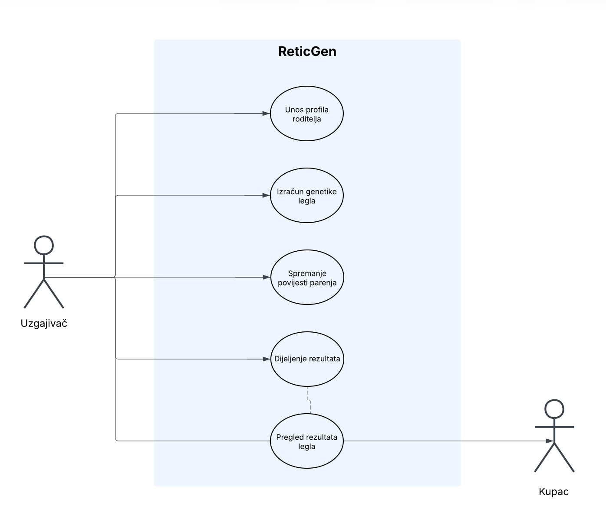

# Snake Genetics

Ovaj projekt je backend sustav izgrađen pomoću **Python Flask** okvira za izračunavanje i pohranu genetike mrežastih pitona. Sustav omogućuje korisnicima da izračunaju vjerojatnost genotipa potomstva, trajno spreme te podatke u bazu podataka (SQLite) te upravljaju njima putem punog **CRUD** sustava.

## Use Case dijagram



## Korišteno

*   **Backend:** Python 3 + Flask
*   **Baza podataka:** SQLite + Pony ORM (Object-Relational Mapping)
*   **Frontend:** HTML, CSS, JavaScript (vanilla) — Jinja2 templating kroz Flask
*   **Kontejnerizacija:** Docker
*   **Genetska logika:** Prilagođeni algoritmi za izračun fenotipova i genotipova (kodominantni i super geni)

## Struktura projekta

```
ReticGen/
├── main.py                  # Flask rute (CRUD + HTML render)
├── genetika_zmija.py        # Algoritam za izračun gena
├── genska_lista.py          # Popis kodominantnih i super gena
├── leglo.py                 # Pony ORM model (Leglo entitet)
├── kreirano_leglo.sqlite    # SQLite baza
├── requirements.txt         # Python ovisnosti
├── Dockerfile               # Docker build recept
├── templates/
│   ├── index.html           # Kalkulator (početna stranica)
│   └── arhiva.html          # Pregled spremljenih legala
└── static/
    └── style.css            # Vlastiti CSS
```

## Funkcionalnosti (CRUD)

Aplikacija nije samo kalkulator, već i digitalna arhiva legala:

*   **Create (Stvori):** `/` (POST) – Izračunava genetiku i automatski sprema zapis u bazu.
*   **Read (Pročitaj):**
    *   `/` (GET) – HTML kalkulator za odabir roditelja i izračun.
    *   `/<id>` (GET) – Dohvaća specifično leglo putem jedinstvenog ključa (JSON).
    *   `/arhiva` (GET) – Vraća JSON popis svih spremljenih legala (za Postman).
    *   `/pregled-arhiva` (GET) – HTML pregled arhive u pregledniku.
*   **Update (Ažuriraj):** `/azuriraj/<id>` (PUT) – Omogućuje izmjenu roditelja ili rezultata postojećeg zapisa.
*   **Delete (Obriši):** `/izbrisi/<id>` (DELETE) – Trajno uklanja zapis iz povijesti.

## Pokretanje

### Lokalno (Python)

```bash
pip install -r requirements.txt
python main.py
```

Aplikacija će biti dostupna na `http://127.0.0.1:5000/`.

### Kroz Docker

```bash
docker build -t reticgen .
docker run -p 5000:5000 reticgen
```

Aplikacija će biti dostupna na `http://localhost:5000/`.

## Testiranje API-ja

JSON rute (`/`, `/<id>`, `/arhiva`, `/azuriraj/<id>`, `/izbrisi/<id>`) mogu se testirati kroz Postman ili sličan alat. Primjer POST tijela za izračun:

```json
{
    "zmija1": ["Tiger", "Sunfire"],
    "zmija2": ["Motley"]
}
```
